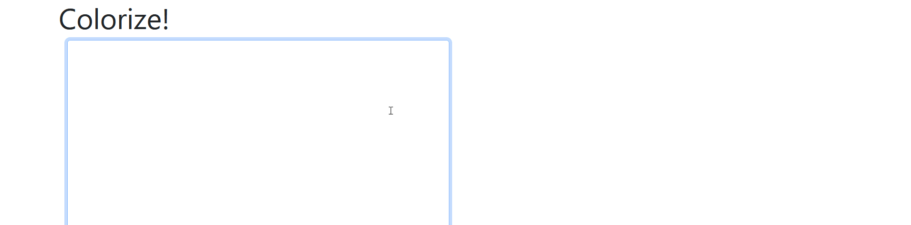

# Vizualizing Rhymes 

A web application to view the sounds and stresses of different words. 

## Project Status

This project is still in development. Functionality to edit word syllables and sounds in progress. Will be deployed on cloud platform

## Example:

## Inspiration 

A couple of summers ago, I felt really nostalgic for old Eminem songs and rediscovered one of his greatest hits [The Way I Am](https://www.youtube.com/watch?v=82lB-gI-uuQ). Though I'm not his biggest fan today, I couldn't help but be enthralled by his flow, his delivery, and, of course, his rhymes. 

I wanted to make a webapp that vizualizes the pronunciation of words allowing for insight into rhyme schemes. I have never worked with React, but have worked with Flask and wanted to implement both. This project makes uses of the [`pronouncing` library](https://pypi.org/project/pronouncing/) as well as [`dictionaryapi`](https://dictionaryapi.com/) provided by Merriam-Webster. 

## Going Forward

- CRUD operations for words i.e change color and listed pronunciation
- Front-end design 
- Hosting on a cloud platform 
